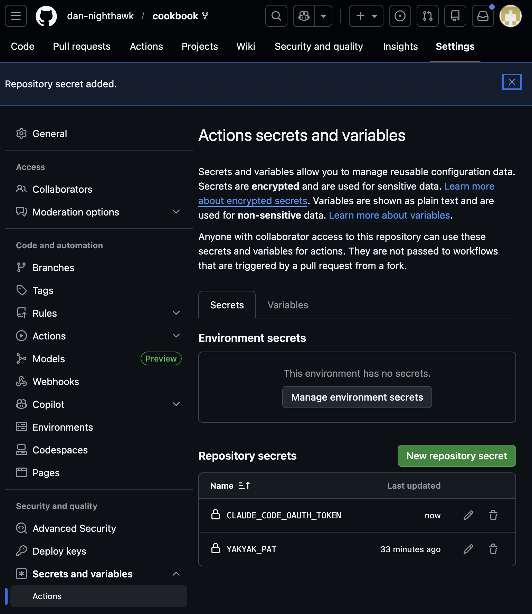
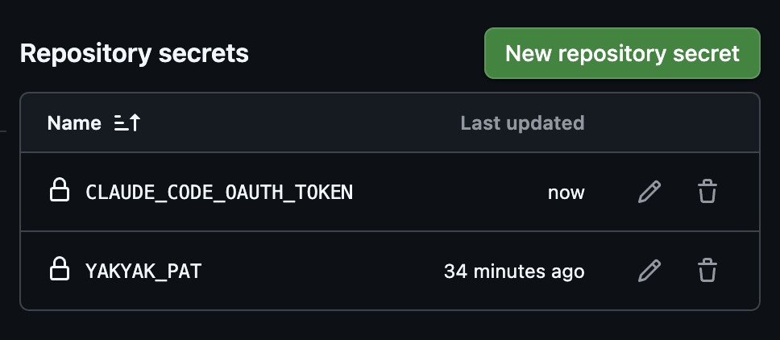
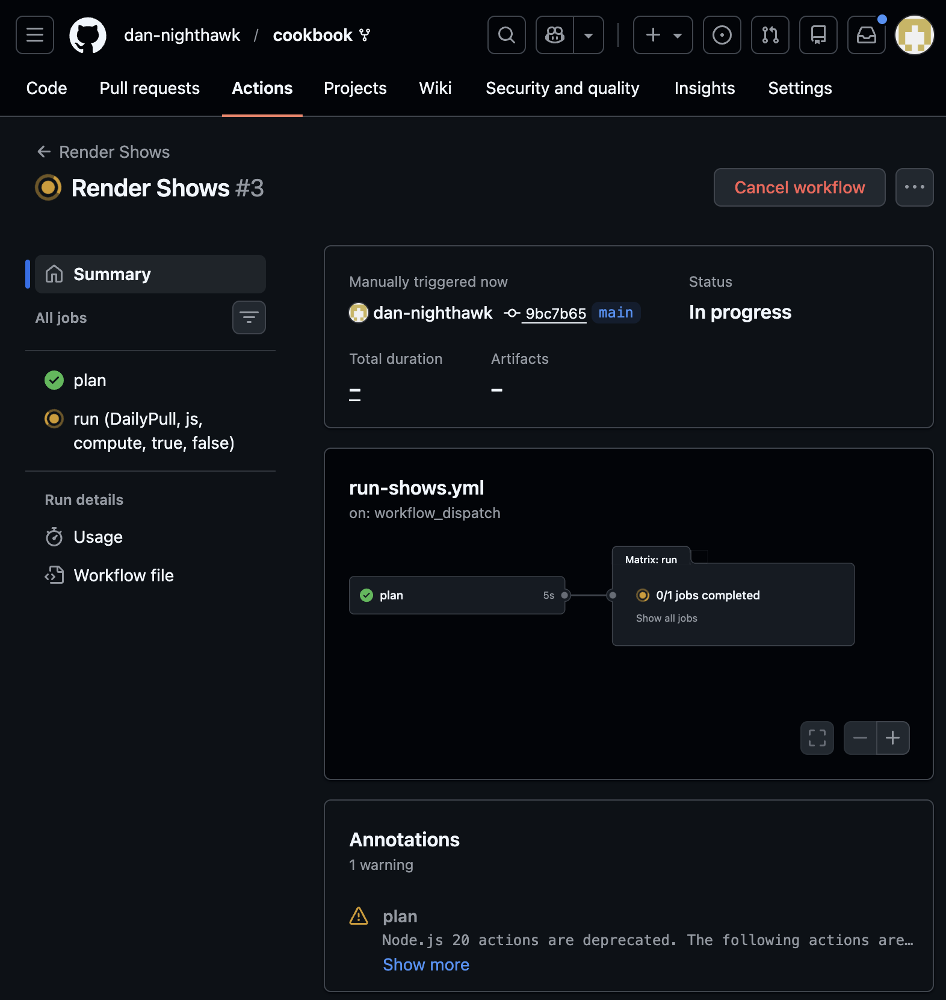
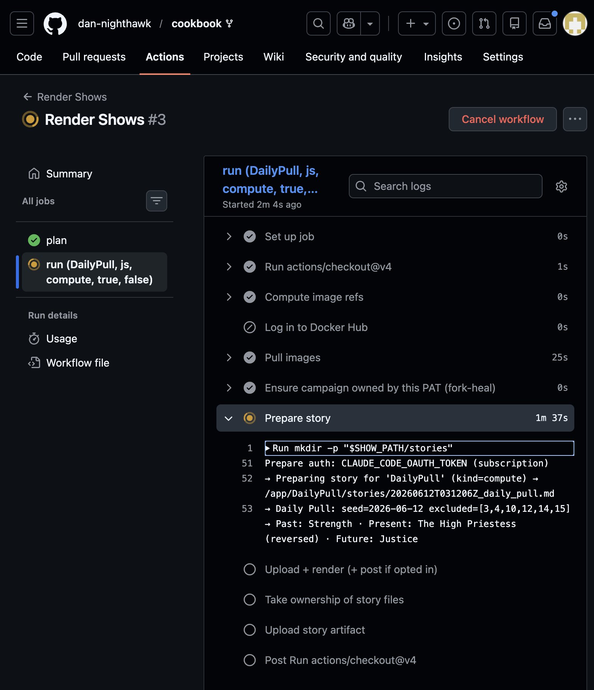
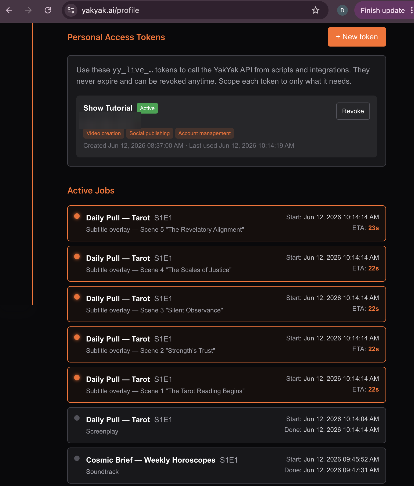
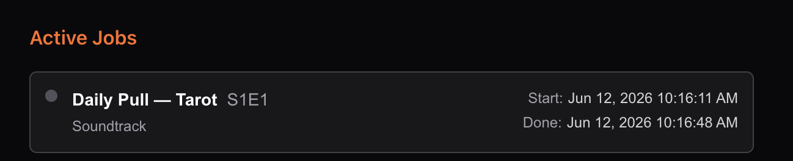
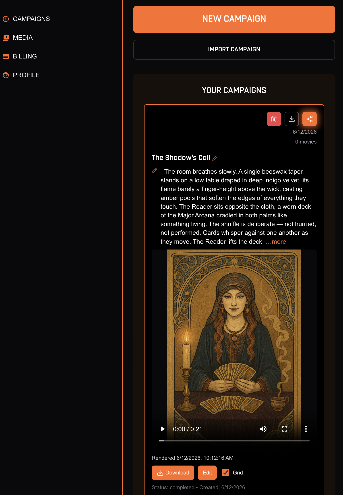

# Screen walk-through: DailyPull

A click-by-click tour of running the **[`DailyPull`](../show/DailyPull/)** show — the
tarot show whose story is **written by a model**. On top of the YakYak PAT from the
[Horoscopes walk-through](walkthrough-horoscopes.md), DailyPull needs *your own AI*: a
Claude OAuth token added as a second secret. This tour covers getting that token,
wiring it up, and watching the episode render through to a finished movie with a
soundtrack.

← back to [How to run a show](../show/README.md#how-to-run-a-show)

> Assumes you've already forked the repo, enabled Actions, and added your `YAKYAK_PAT`
> — see the [Horoscopes walk-through](walkthrough-horoscopes.md) for those steps.

---

## a) Add your own AI

DailyPull's `compute.js` draws a date-seeded 3-card tarot spread, then `claude -p`
dramatizes it — so the **story step needs a model credential**. The campaign is a
recurring tarot cast; here's the look it renders.

So **before you dispatch anything**, give the run a model credential — otherwise the
story step has nothing to write with. YakYak accepts either an `ANTHROPIC_API_KEY` or a
**`CLAUDE_CODE_OAUTH_TOKEN`**; we'll use the latter.

## b) Get a Claude OAuth token

Run **`claude setup-token`** in a terminal. It mints a long-lived OAuth token
(`sk-ant-oat01-…`, valid for a year) to export as `CLAUDE_CODE_OAUTH_TOKEN`. Copy it.

## c) Add it as a secret

In your fork, go to **Settings → Secrets and variables → Actions → New repository
secret**. Name it exactly **`CLAUDE_CODE_OAUTH_TOKEN`** and paste the `sk-ant-oat01-…`
value, then **Add secret**.

The secret is saved.

Your fork now holds both secrets — `YAKYAK_PAT` (to render) and
`CLAUDE_CODE_OAUTH_TOKEN` (to write the story).

## d) Monitor story prep + render (Actions console)

Dispatch DailyPull again now that the model credential is in place.

The run goes **In progress** — `plan` is green, the DailyPull render job is running.

Expand the **Prepare story** step to watch the model work: it authenticates with
`CLAUDE_CODE_OAUTH_TOKEN` and draws the tarot spread (Past / Present / Future).

The **Upload + render** step then calls the YakYak API — checking the token balance,
generating the screenplay, and polling for scene generation.

## e) Monitor rendering on yakyak.ai/profile

Switch to **yakyak.ai/profile** to watch the render live — the **Active Jobs** panel
streams each scene's subtitle overlay and screenplay job for the DailyPull episode.

## f) The render finishes with a Soundtrack

The final stages run in sequence — the **Soundtrack** job is the one that finishes the
movie off.

You can see the tail of the pipeline complete: **Soundtrack → Concatenating scenes →
Subtitle burn**.

## g) Enjoy your movie

The rendered episode lands on your campaign, marked **completed**.

Hit play — your model-written, fully rendered tarot episode. Enjoy.

