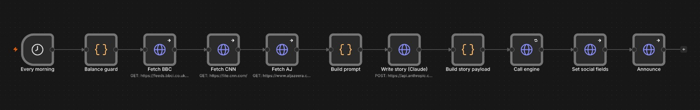

# Replicating Breaking Bricks News in n8n (episode mode)

**Goal:** run the cookbook's flagship show — [`show/BreakingBricksNews`](../../../show/BreakingBricksNews/)
("BBN": the day's real Middle East headlines, restaged as a satirical brick-built newscast) —
on an n8n instance instead of the GitHub-Actions showrunner, using the
[`workflow.import-regen-post.json`](../workflow.import-regen-post.json) engine in
**`episode` mode**: one campaign, one new episode per day.

This doc maps every piece of the showrunner pipeline onto n8n and documents the **built,
importable front-end**: [`workflow.bbn-daily.json`](../workflow.bbn-daily.json). Together
with the engine it is the complete daily pipeline; §5 covers assembly and configuration.

---

## 1. What the showrunner does each day (and what already maps)

The daily BBN run (`upload_to_yakyak.py --show show/BreakingBricksNews`, scheduled by
`CADENCE="daily"`) is, distilled:

| # | Showrunner step | n8n equivalent |
| --- | --- | --- |
| 1 | **Cron fires** (plan_due_shows.sh picks daily shows) | **Schedule Trigger** node (cron) |
| 2 | **Token-balance guard** — `GET /users/{userId}`, abort below `MIN_TOKEN_BALANCE=2000` | small **Code/IF** guard node (optional but recommended) |
| 3 | **Write the story** — `claude -p` runs [`prompt.md`](../../../show/BreakingBricksNews/prompt.md): WebFetch BBC RSS + CNN Lite + Al Jazeera, keep 24 h items, weave 3–6 into a ten-scene script (Bob Brikko opens and closes; one 8–12-word dialog line per scene, no trailing period) | **3 HTTP fetch nodes + 1 Claude API node** (see §3 — the one real adaptation) |
| 4 | **Story → plot text** — `storyToDescription()` collapses `## Scene N` blocks into one plot string, applying `CAST_ALIASES` (`Khamenei→Mojtaba`, …) | **Build story payload** Code node — direct port (§3) |
| 5 | **Pick the episode slot** — lowest `(season, episode)` with empty `renderedMovieUrl`; `create-new-season` when all rendered; switch campaign to `basic` mode | ✅ **already in the engine** — Resolve target, `mode: "episode"` |
| 6 | **Write + generate** — `set-movie-metadata {plot}` → `gen-movie-screenplay` (writes the screenplay AND renders every scene server-side 💸) | ✅ **already in the engine** — Apply changes |
| 7 | **Wait for generation** | ✅ **already in the engine** — Generation progress loop |
| 8 | **Pin the BBN intro track** — `set-soundtrack-audio {movieId, audioPath}` + `set-soundtrack {movieId, volumePercentage: 45}` | ✅ **in the engine** — optional `changes.movie.soundtrackAudioPath` / `soundtrackVolume` fields (§4.1) |
| 9 | **Social title + caption** — headline-derived caption; ≤50-char title via a model call; `update-movie-social-description` | ✅ **in the front-end** — title folded into the story call; **Set social fields** node (§4.2) |
| 10 | **Render** — `export-render {force:true}`, poll to completion | ✅ **already in the engine** |
| 11 | **Post** — publish to social (`POST="true"`), or render-only | Review-first chat webhook (**Announce** node); social posting is the deliberate opt-in (§4.3) |
| 12 | **Archive the story file** to `stories/<UTC>_latest_update.md` | The story markdown is preserved on **Build story payload**'s output in every execution (§4.4) |

Steps 5–7 and 10 — the hard, stateful part — are exactly what episode mode was built for,
so the BBN-specific work is the *front end* (steps 1–4) plus three small finalization
nodes (8–9, 11).

---

## 2. Architecture: two workflows, not one

Keep the generic engine untouched and put BBN in its own workflow that **calls the
engine's webhook**:

```
┌─ BBN daily (this doc) ───────────────────────────────────────────┐
│ Schedule ► Balance guard ► Fetch×3 ► Claude ► Story→plot ►       │
│ Build payload ► HTTP POST http://localhost:5678/webhook/yakyak-regen ─┼─► engine runs
│ ◄─────────────────────────── { url, movieId, … } ◄───────────────┼── episode mode
│ ► Finalize (soundtrack/social — §4) ► Post to chat/social        │
└──────────────────────────────────────────────────────────────────┘
```

Why split: the engine stays reusable for every show (and for patch-mode automations); BBN
concerns (news sources, cast map, soundtrack, captioning) live where they belong; and the
engine's webhook responds only when the episode is **rendered**, so the front-end gets the
finished `movieId`/`url` back synchronously and can finalize.

> **Ordering note:** the engine renders before the front-end regains control, so the
> soundtrack pin lives **inside the engine** — the optional
> `changes.movie.soundtrackAudioPath` / `soundtrackVolume` fields (§4.1), applied in
> **Apply changes** before generation and render. The engine stays generic: shows without
> a pinned track simply omit the fields.

---

## 3. The BBN front-end workflow, node by node (as built)

The importable file is [`workflow.bbn-daily.json`](../workflow.bbn-daily.json) — 11 nodes,
one straight line:

```
Every morning (cron 0 6 * * *)
 └► Balance guard          Code — decode userId from PAT, GET /users/{userId},
 │                          throw if tokenBalance < BBN_MIN_TOKEN_BALANCE (2000)
 └► Fetch BBC / CNN / AJ   3× HTTP, text response, 30 s timeout, continue-on-error
 └► Build prompt           Code — the adapted prompt.md with sources inlined (15 kB/source
 │                          cap); aborts if ALL THREE sources failed
 └► Write story (Claude)   HTTP — POST api.anthropic.com/v1/messages, model
 │                          claude-opus-4-8, max_tokens 16000, adaptive thinking,
 │                          x-api-key + anthropic-version headers, 10 min timeout
 └► Build story payload    Code — storyToDescription() port (cast aliases, one-line prose,
 │                          dialog append, no trailing period), ≤50-char social title from
 │                          the story's '## Social title:' line, headline caption
 └► Call engine            HTTP — POST the yakyak-regen webhook, mode: episode,
 │                          pinned BBN_CAMPAIGN_ID, soundtrack fields, 45 min timeout,
 │                          retry ×2 (safe: a re-run lands on the same unrendered slot)
 └► Set social fields      HTTP — update-movie-social-description, continue-on-error
 └► Announce               HTTP — post title + movie URL to BBN_CHAT_WEBHOOK_URL,
                            continue-on-error
```

The same line on the n8n canvas:



Design notes, in the order they'll matter:

- **The prompt adaptation (Build prompt).** The showrunner's `claude -p` fetches the web
  *itself* via its WebFetch tool; an API call can't, so the three HTTP nodes fetch and the
  prompt inlines the material. Two edits versus
  [`prompt.md`](../../../show/BreakingBricksNews/prompt.md): STEP 1 becomes "the fetched
  source material is included below" (with per-source *unavailable* markers so one blocked
  site doesn't kill the run), and STEP 4 becomes "reply with only the markdown" plus a
  requested `## Social title:` line — one model call covers story *and* social title,
  where the showrunner made two. Cast, tone rules, ten-scene shape, Bob Brikko
  opening/closing, and the no-trailing-period dialog rule carry over verbatim; the
  committed samples in [`stories/`](../../../show/BreakingBricksNews/stories/) are the
  acceptance reference.
- **The story parser (Build story payload)** is a faithful port of `storyToDescription()`
  from [`show/showrunner/story-format.js`](../../../show/showrunner/story-format.js),
  including the `CAST_ALIASES` map — both *Mojtaba* and *Khamenei* collapse to the
  `Mojtaba` character, which is what keeps the screenplay generator on the campaign's
  pinned cast. It also strips a trailing `.` from dialog lines defensively and refuses to
  proceed if the response contains no `## Scene` blocks (or is a Claude refusal).
- **The engine payload (Call engine)**:

  ```jsonc
  {
    "target": { "mode": "episode", "campaignId": "<BBN_CAMPAIGN_ID>" },  // pinned — a
    "changes": {                                    // production show never name-matches
      "movie": {
        "plot": "…parsed plot…",                    // title: the screenplay names it
        "soundtrackAudioPath": "<BBN_SOUNDTRACK_AUDIO_PATH>",   // §4.1
        "soundtrackVolume": 45
      }
    },
    "chatWebhookUrl": ""                            // announcement is the front-end's job
  }
  ```

  No `importData` — the campaign already exists;
  [`campaign.import.json`](../../../show/BreakingBricksNews/campaign.import.json) remains
  the manual, once-ever provisioning path, exactly as for the showrunner.
- **One announcer.** The front-end passes `chatWebhookUrl: ""` to the engine and announces
  itself (after the social fields are set), so the movie link is posted exactly once, with
  the episode title.

---

## 4. The finalization pieces (all implemented)

### 4.1 The BBN intro soundtrack — engine fields
The engine's **Apply changes** node accepts two optional fields on `changes.movie` (both
modes; shows without a pinned track simply omit them):

| Field | Engine call | BBN value |
| --- | --- | --- |
| `soundtrackAudioPath` | `POST /workflow/set-soundtrack-audio { movieId, audioPath }` | `show.env` `SOUNDTRACK_AUDIO_PATH` |
| `soundtrackVolume` | `POST /workflow/set-soundtrack { movieId, volumePercentage }` | `show.env` `VOLUME` (45) |

Each episode reuses the same intro track by **content address** — no upload, the render
pulls it straight from the CDN. The path's `beta/` prefix on a prod campaign is
**normal** — env prefixes live in one shared bucket; the path is a content address, not
an ownership claim (see [`docs/forking.md`](../../../docs/forking.md)).

### 4.2 Social title + caption — front-end nodes
The ≤50-character title is requested as a `## Social title:` line inside the same story
call (one model call, where the showrunner made two) and clamped in **Build story
payload**; the caption is derived from the story's "Headlines we drew from" bullets. The
**Set social fields** node then posts:

```
POST /workflow/update-movie-social-description
{ "movieId": "…", "socialTitle": "…", "socialDescription": "…" }
```

It runs *continue-on-error* — cosmetic metadata must never kill a rendered episode.

### 4.3 Posting (`POST="true"`)
BBN is the cookbook's auto-posting show. Options, in order of increasing commitment:
review-first (chat webhook only — the default here), n8n's native YouTube/Instagram
nodes, or the YakYak social endpoints demonstrated in
[`course/08-social-post`](../../../course/08-social-post/). Posting is irreversible;
keep it behind an explicit IF node on a `post: true` payload flag, mirroring the
showrunner's `--post` gate.

### 4.4 Story archive
The showrunner commits each story to `stories/` **from a local run only** — CI never
commits back to the repo (artifacts instead). The n8n replica takes the artifact-like
default: the full story markdown is preserved on **Build story payload**'s output in
every execution (open the run in the Executions tab to read it). Add a **GitHub node**
("create file" to `show/BreakingBricksNews/stories/<UTC>_latest_update.md`) only if you
want the repo trail, and accept that this deviates from the CI rule.

---

## 5. Assembly & configuration

Two workflows on one n8n instance, chained over the engine's webhook (the front-end calls
`http://localhost:5678/webhook/yakyak-regen` on its own instance):

1. **Import the engine** — [`workflow.import-regen-post.json`](../workflow.import-regen-post.json)
   (already done if you followed [`docs/n8n_readme.md`](../../../docs/n8n_readme.md)) —
   and **Publish** it: the front-end needs its production webhook live.
2. **Import the front-end** — [`workflow.bbn-daily.json`](../workflow.bbn-daily.json) —
   and **Publish** it to arm the daily schedule.
3. **Set the env vars** on the n8n instance (docker `-e` flags, alongside the ones the
   engine already needs — `YAKYAK_TOKEN`, `YAKYAK_API_BASE`,
   `N8N_BLOCK_ENV_ACCESS_IN_NODE=false`, `N8N_RUNNERS_ENABLED=true`):

| Env var | Required | Value |
| --- | --- | --- |
| `ANTHROPIC_API_KEY` | ✅ | For the story call (`Write story (Claude)`). |
| `BBN_CAMPAIGN_ID` | ✅ | The BBN campaign id — `show.env` `CAMPAIGN_ID` (`a7e7b9c5-0959-41a0-9176-509a3b197775` for the production show). |
| `BBN_SOUNDTRACK_AUDIO_PATH` | — | The intro track's content address — `show.env` `SOUNDTRACK_AUDIO_PATH`. Omit to skip the soundtrack pin. |
| `BBN_SOUNDTRACK_VOLUME` | — | `45` (`show.env` `VOLUME`). |
| `BBN_CHAT_WEBHOOK_URL` | — | Slack/Discord/Teams incoming webhook for the announcement. |
| `BBN_MIN_TOKEN_BALANCE` | — | Default `2000` (`show.env` `MIN_TOKEN_BALANCE`). |
| `YAKYAK_ENGINE_URL` | — | Default `http://localhost:5678/webhook/yakyak-regen`. Point elsewhere if the engine runs on another instance. |

4. **First run by hand:** open the front-end → **Test workflow** — the Schedule trigger
   fires once immediately. Watch both executions (front-end + engine) in the Executions
   tab. On **beta** first (`YAKYAK_API_BASE=https://api.beta.yakyak.ai`, beta PAT, beta
   campaign id) the whole run is effectively free.

**Runtime shape:** each morning produces two executions — "BBN daily" (spends most of its
life inside the 45-minute engine call) and the engine run (slot picking, screenplay poll,
render poll). The boundary between them is one JSON payload you can copy out of **Call
engine**'s input and replay with `curl` when debugging.

---

## 6. Ops notes

- **Cost per episode:** `gen-movie-screenplay` renders every scene (AI still per scene 💸,
  ~10 scenes for BBN) plus concat + soundtrack. This is inherent to the show, not to n8n —
  identical to a showrunner run. The **Balance guard** node is what keeps a drained
  account from producing half an episode.
- **Re-runs are self-healing.** If a run dies mid-generation, the next run's slot picker
  finds the *same* unrendered episode (its `renderedMovieUrl` is still empty) and
  regenerates it — no orphaned half-episodes accumulate. This mirrors the showrunner's
  `pickNextEpisode` semantics.
- **Seasons are automatic.** When every slot is rendered, the engine calls
  `create-new-season`; if that outlasts the Code node's ~60 s budget, the run fails with
  "season creation is still in progress" — the schedule's next tick (or a manual re-run)
  picks up the minted slots.
- **Stalls:** the showrunner re-kicks stuck scene pipelines (re-assert `basic` mode +
  `POST /workflow/resume`). The engine doesn't; a stalled generation eventually times out
  the run. Mitigation: n8n's *retry on fail* on the engine-call node — a retry lands on
  the same slot (see self-healing above). If stalls prove common, port the re-kick into
  the engine's settled-check as a `resume` call after N unchanged polls.
- **Token/env:** one prod `yy_live_…` PAT with `video_creation` (+ `social_publishing`
  if §4.3 goes live) as `YAKYAK_TOKEN`, plus `ANTHROPIC_API_KEY` for the story call. Prove the
  pipeline on **beta** first (beta accounts carry a large balance): beta base URL, beta
  campaign, same workflow.

## 7. What still favors the showrunner

Honest limits of the n8n replica: `claude -p` gives the story step agentic web access
(it follows links, retries fetches) where the story call sees only what the three fetch nodes pulled; the
showrunner's stall re-kick loop is battle-tested; and per-show config lives in versioned
`show.env` files rather than n8n workflow parameters. None of these block a daily BBN —
they're the polish gap between "works" and "runs unattended for months."
