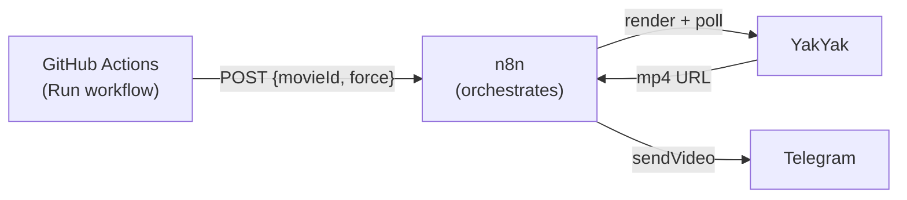
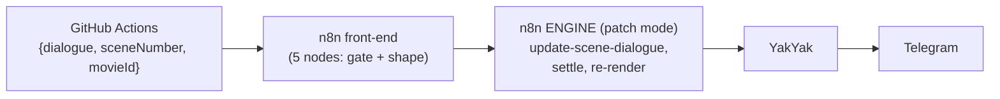

# Render a movie → deliver to Telegram (n8n, triggered from GitHub)

Render a YakYak movie and deliver the finished video into a **Telegram** chat, with
**n8n** doing the orchestration and a GitHub Actions button as the trigger.



- **[`.github/workflows/render-to-telegram.yml`](../../../.github/workflows/render-to-telegram.yml)** —
  the **Run workflow** button. A thin trigger: it POSTs `{movieId, force}` to the n8n
  webhook and blocks until n8n reports delivery. No YakYak/Telegram credentials in
  GitHub — they live on the n8n instance.
- **[`../workflow.render-to-telegram.json`](../workflow.render-to-telegram.json)** —
  the n8n workflow: webhook → token gate → `export-render` → poll `get-movie-progress` →
  `get-movie` → Telegram `sendVideo` (link fallback) → respond `{url, delivered}`.
- Prefer no orchestrator? The same flow exists as a zero-dependency script:
  [`../../telegram/render-to-telegram.mjs`](../../telegram/render-to-telegram.mjs)
  (see [`../../telegram/README.md`](../../telegram/README.md) — also covers the
  2-minute Telegram bot setup used here).

## Setup

### 1. Telegram bot

Follow [`../../telegram/README.md`](../../telegram/README.md) — BotFather token +
chat id, ~2 minutes.

### 2. n8n instance

Import [`../workflow.render-to-telegram.json`](../workflow.render-to-telegram.json),
add the env vars, and **Publish**:

| Env var | Required | Value |
| --- | --- | --- |
| `YAKYAK_TOKEN` | ✅ | `yy_live_…` PAT that owns the movies (already set for the engine). |
| `TELEGRAM_BOT_TOKEN` | ✅ | From @BotFather. |
| `TELEGRAM_CHAT_ID` | ✅ | Default chat (a per-run `chatId` in the body overrides it). |
| `RENDER_WEBHOOK_TOKEN` | ✅ when public | Shared secret; callers must send it as `x-render-token`. **This webhook triggers paid renders — never expose it without the token.** |
| `YAKYAK_API_BASE` | — | Default `https://api.yakyak.ai`. |

### 3. Reach n8n from GitHub

GitHub's runners **cannot reach `localhost:5678`** — the webhook needs a public URL:

- **Quick (dev):** a tunnel — `cloudflared tunnel --url http://localhost:5678` prints a
  public `https://….trycloudflare.com` URL (or `ngrok http 5678`). Free, but the URL
  changes per tunnel run — update the secret when it does.
- **Proper:** run n8n on a server you already have (docker, same image/env vars) and
  point a hostname at it.

### 4. GitHub secrets

Repo → Settings → Secrets and variables → Actions:

| Secret | Value |
| --- | --- |
| `N8N_WEBHOOK_URL` | `https://<your-n8n-host>/webhook/yakyak-render-telegram` |
| `N8N_RENDER_TOKEN` | Same value as `RENDER_WEBHOOK_TOKEN` on the n8n instance. |

## Run it

**From GitHub:** Actions tab → *Render movie → Telegram* → **Run workflow** → paste a
movie id (or keep the default). The id is the `movieId` query param on the IG grid:
`https://yakyak.ai/ig/<userId>?movieId=<id>` — the movie must be owned by the n8n
instance's `YAKYAK_TOKEN` account. The action's log ends with the delivered URL.

**From a terminal:**

```bash
curl -sS -X POST "https://<your-n8n-host>/webhook/yakyak-render-telegram" \
  -H "Content-Type: application/json" -H "x-render-token: <token>" \
  -d '{"movieId": "acffd965-e17f-4d14-9273-72858d7e38fd"}'
```

## Variant: change a dialogue line first, then render

The educational sibling — same delivery, but the movie is **edited** before rendering:



- **[`.github/workflows/patch-dialogue-to-telegram.yml`](../../../.github/workflows/patch-dialogue-to-telegram.yml)** —
  inputs: `dialogue` (the new line — don't end it with a period), `movieId`, `sceneNumber`.
- **[`../workflow.patch-dialogue-to-telegram.json`](../workflow.patch-dialogue-to-telegram.json)** —
  validates, then POSTs a patch payload to the **engine**'s webhook
  (`/webhook/yakyak-regen` on the same instance) and delivers the engine's result.
  Requires the engine workflow to be imported and published too.
- Extra GitHub secret: `N8N_PATCH_WEBHOOK_URL` =
  `https://<your-n8n-host>/webhook/yakyak-patch-telegram` (reuses `N8N_RENDER_TOKEN`).

Why it exists next to the direct-render workflow: side by side they show the two ways to
build on YakYak in n8n — **call the API directly** when the job is a fixed sequence
(render + deliver), **chain through the engine** when the job needs its machinery
(campaign resolution, diff-aware scene edits, generation waits). The engine is diff-aware,
so re-running with the same dialogue is a free no-op: `{"changed": 0}`, only the re-concat
happens, and the Telegram caption says so.

For **multi-channel** delivery (Telegram + Discord + Slack from one request), see
[`workflow_patch_dialogue_to_message.md`](./workflow_patch_dialogue_to_message.md).

## Notes

- **Cost:** each run re-renders the final concat + soundtrack (per-scene assets are
  reused). `"force": false` skips the re-render when YakYak thinks nothing changed.
- **Delivery:** Telegram fetches the mp4 by URL (≤ ~20 MB). Larger renders fall back to
  a message with the CDN link — a finished render is never lost. The webhook response
  reports which happened: `{"delivered": "video" | "link"}`.
