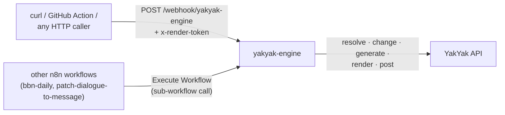

# The YakYak engine — automating YakYak with n8n, from zero to a movie factory

**Audience:** you've never used n8n. **Goal:** a workflow you `POST` a change plan to (or
call from another workflow), that patches a standing YakYak movie **or** mints a new
episode, waits for regeneration, renders, and hands back the finished movie URL.

The engine is **[`workflow.yakyak-engine.json`](../workflow.yakyak-engine.json)** — one
importable workflow, callable two ways:



All secrets live in n8n **credentials** (no environment variables): the YakYak PAT in a
Bearer Auth credential, the webhook door key in a Header Auth credential. That's what makes
the engine safe to run on a shared or cloud n8n instance.

Front-ends already built on it:

- **[`workflow.patch-dialogue-to-message.json`](../workflow.patch-dialogue-to-message.json)** —
  patch mode: change one dialogue line, deliver the video to Telegram/Discord/Slack
  ([full beginner tutorial](./workflow_patch_dialogue_to_message.md) — includes the
  click-by-click credential setup this doc assumes).
- **[`workflow.bbn-daily.json`](../workflow.bbn-daily.json)** — episode mode: the Breaking
  Bricks News daily show ([walkthrough](./breaking_bricks_news.md)).

---

## 1. The 60-second mental model

A YakYak **movie** is a list of **scenes**. Each scene is built by a 4-stage pipeline,
in this order:

```
   image  ──►  movie (Ken Burns)  ──►  subtitle-movie (voiceover)  ──►  burn (subtitles onto video)
   still       animated clip           narration track                 final scene clip
```

Then all the scene clips are **concatenated** and a **soundtrack** is muxed on top to make
the finished movie:

```
   scene 1 burn  ┐
   scene 2 burn  ├──►  concat  ──►  + soundtrack  ──►  finalMovieUrl
   scene N burn  ┘
```

An **exported campaign** (the `…----export.json` you get from YakYak) contains every scene
*with the URLs of all four artifacts already filled in*. That is the key to "reuse vs
regenerate":

> **When you import a template, every scene keeps its existing image/movie/subtitle/burn
> URLs. A scene you don't touch is reused verbatim — no regeneration, no tokens spent.
> You only pay for the scenes you deliberately change.**

Changing a scene is done through **one** endpoint per kind of change, and that endpoint
*automatically re-runs the correct part of the pipeline*:

| You change… | Call | What re-runs (everything downstream) |
| --- | --- | --- |
| Scene **story / description** | `update-scene-story` | image → movie → burn |
| Scene **dialogue** (narration) | `update-scene-dialogue` | subtitle → burn |
| Scene **animation** (pan/zoom) | `update-scene-animation-prompt` | movie → burn |
| Subtitle **styling** (font/colour via lead cast) | `update-scene-lead-cast` | subtitle → burn |
| Nothing | *(skip the scene)* | reused as-is |

There are also two "re-run without editing" endpoints for retries:

| Goal | Call |
| --- | --- |
| Re-run a scene from a stage with the **same** content (e.g. you want a different random image) | `rerun-scene` `{ from: 'image' \| 'movie' \| 'subtitle' \| 'burn' }` |
| Regenerate **one** asset only, no cascade | `regen-scene-asset` `{ asset: 'image' \| 'movie' \| 'subtitle' \| 'burn' }` |

### The two run modes

The engine never duplicates campaigns. Every run **resolves** a target instead — one
campaign per show, forever — and then routes by intent:

| Mode | For | What happens | Version trail |
| --- | --- | --- | --- |
| **`patch`** (default) | Small, event-driven changes — a GitHub push, a chat command, a re-delivered webhook | Edits **one standing movie** in place via `update-scene-*` and re-renders — the campaign's **trailer** by default, or the episode pinned via `target.movieId`. **Diff-aware**: a change whose value already matches is skipped (free). | The movie's **render-history** — every render's URL is immutable and keeps working |
| **`episode`** | Significant new content per run — showrunner-style daily/weekly episodes | Picks the **next unrendered slot** in the campaign (minting a new season when full), writes the plot, and `gen-movie-screenplay` writes + renders every scene server-side 💸 | One campaign, N distinct episodes |

That's the whole model. The rest of this doc is plumbing.

---

## 2. Prerequisites

### 2.1 A YakYak personal access token (PAT)

The API authenticates with a **PAT** shaped `yy_live_…`.

1. Sign in at [yakyak.ai](https://yakyak.ai/) → open **`/profile`**.
2. Under **Personal Access Tokens** → **+ New token**.
3. Name it (e.g. `n8n`) and give it the **`video_creation`** scope (required to import,
   edit, and render). Add **`social_publishing`** only if you'll auto-post.
4. **Copy the `yy_live_…` value now** — it's shown once.

> 💡 The engine keeps the token in an n8n **credential**, and n8n Code nodes can't read
> credentials — so the engine **cannot decode your `userId` from the token** the way the
> old env-var setup did. You only need a `userId` at all for adopt-by-name and import
> (they go through `list-campaign/:userId`); pass it in the payload then. Calls pinned by
> `campaignId` or `movieId` never need it.

> 💰 **Top up your token balance first.** Regenerating scenes and rendering cost tokens.
> Reused scenes are free; only what you change (and the final concat/soundtrack) is billed.

### 2.2 An exported campaign template

Any campaign you can see in YakYak can be exported:

```
GET https://api.yakyak.ai/workflow/export-campaign/{campaignId}
Authorization: Bearer yy_live_…
```

The response is the same shape as the `…----export.json` file you already have. Save it —
you'll feed it in as `importData` **on the first run only**: the engine imports it once to
provision your campaign, and every later run finds that campaign by name and reuses it. If
your campaign already lives in your account, you don't need an export at all — pass
`target.campaignId` or `target.campaignName` instead.

### 2.3 An output chat webhook (optional but recommended)

Slack, Discord, and Teams all support **incoming webhooks** — a URL you `POST` a
`{ "text": "…" }` body to, and it appears as a message. Create one:

- **Slack:** *Apps → Incoming Webhooks → Add to a channel* → copy the `https://hooks.slack.com/…` URL.
- **Discord:** *Channel → Edit → Integrations → Webhooks → New Webhook* → copy URL. (Discord's
  field is `content`, not `text` — change the body key, or use n8n's native **Discord** node.)

For richer delivery (playable videos in Telegram/Discord/Slack via bots), chain a
front-end instead — see the [multi-channel tutorial](./workflow_patch_dialogue_to_message.md).

---

## 3. Prove it works *without* n8n first (5 minutes)

Before wiring nodes, run the reference script
[`regen-from-template.mjs`](../regen-from-template.mjs). It does the whole flow and prints
the final movie URL. If this works, your token, template, and account are all good — and
any later n8n problem is an n8n-config problem, not a YakYak one.

> 🧪 **Keep token and API base in the same environment.** Tokens are per-environment
> (separate JWT secrets). Beta base is `https://api.beta.yakyak.ai`, prod is
> `https://api.yakyak.ai`. For heavy iteration prefer **beta** (its accounts carry a large
> token balance, so re-running is effectively free); use prod only for the real thing.

```bash
cd integrations/n8n

export YAKYAK_TOKEN="yy_live_…"
export MODE="patch"                                   # or "episode"; default patch
export TEMPLATE_PATH="/path/to/your----export.json"   # first run only (provision-once)
# …or target an existing campaign directly:
# export CAMPAIGN_NAME="My Show"                      # adopt by name
# export CAMPAIGN_ID="…"  MOVIE_ID="…"                # or pin ids explicitly
export CHANGES_PATH="./changes.example.json"          # omit for a straight re-render
export CHAT_WEBHOOK_URL="https://hooks.slack.com/…"   # optional

node regen-from-template.mjs
```

Expected output (abridged, patch mode):

```
→ resolving target (mode=patch)…
  campaign=… (reused) movie=…
  10 scenes; 2 change(s) requested
  · scene #3: story
  · scene #5: dialogue (no-op, skipped)
→ waiting for scene regeneration…
→ export-render…
→ waiting for concat + soundtrack…

🎬 Finished movie (patch, 1 change(s)): https://cdn.yakyak.ai/…/final.mp4
```

Note the `(no-op, skipped)`: patch mode compares each change against the scene's current
value and skips identical ones, so re-running the same plan is idempotent and free.

Requires **Node 18+** (built-in `fetch`), no `npm install`. The script is the canonical
spec of the flow — every engine stage below maps to a block in it.

---

## 4. Installing n8n

Two easy options — and because the engine uses **credentials, not env vars**, both work
equally well:

- **n8n Cloud** (nothing to install): sign up at [n8n.io](https://n8n.io/) → hosted
  instance with a URL.
- **Self-hosted with Docker:**

  ```bash
  docker run -it --rm \
    --name n8n \
    -p 5678:5678 \
    -v ~/.n8n:/home/node/.n8n \
    -e N8N_RUNNERS_ENABLED=true \
    docker.n8n.io/n8nio/n8n
  ```

  Open <http://localhost:5678>. On first launch n8n asks for an **email + password** —
  that's just creating the local owner account for *your* instance (stored in `~/.n8n`,
  no n8n.io signup). Pick anything and note it down.

> Front-ends may still read `$env` for their *own* non-secret config (e.g. `bbn-daily`
> reads `BBN_CAMPAIGN_ID`). If you run those on recent self-hosted n8n, add
> `-e N8N_BLOCK_ENV_ACCESS_IN_NODE=false` — recent versions block `$env` in Code nodes by
> default. The engine itself needs nothing.

---

## 5. Importing and configuring the engine

### 5.1 Credentials first

Create two credentials (the engine's nodes find them **by name** — use these exact names):

1. **Bearer Auth** → Bearer Token = your `yy_live_…` PAT → name it **`YakYak API`**.
2. **Header Auth** → Name = `x-render-token`, Value = a random password you invent
   (`openssl rand -hex 24`) → name it **`YakYak render webhook token`**. This is the
   webhook's door key — **the webhook triggers paid renders, never expose it without one.**

Click-by-click with screenshots: [tutorial Part 4](./workflow_patch_dialogue_to_message.md#part-4--create-the-five-credentials-in-n8n).

### 5.2 Import

In n8n: **Create workflow** (blank canvas) → **⋯ menu → Import from File…** →
`integrations/n8n/workflow.yakyak-engine.json` → **Save**. If any node shows a red
triangle, open it and re-pick the credential from the dropdown (with the exact names
above this is usually zero clicks).

### 5.3 What a run looks like (the payload)

Both entry points take the same JSON body:

```jsonc
{
  "target": {
    "mode": "patch",                    // "patch" (default) or "episode"
    "campaignId": "…",                  // optional: pin the campaign explicitly
    "campaignName": "My Show",          // optional: adopt your campaign by name (needs userId)
    "movieId": "…"                      // optional (patch mode): pin the movie — the engine
  },                                    //   derives the campaign from it, no other ids needed
  "importData": { "campaigns": [ /* … */ ] },  // FIRST RUN ONLY: provision-once fallback (needs userId)
  "changes": {
    "movie":  {
      "title": "optional new title",
      "plot":  "episode mode: the story text (REQUIRED there)",
      "soundtrackAudioPath": "optional CDN content-address to pin a soundtrack",
      "soundtrackVolume": 45            // optional, 0–100
    },
    "scenes": [                         // patch mode only
      { "sceneNumber": 3, "action": "story",    "story": "new description…" },
      { "sceneNumber": 5, "action": "dialogue", "dialogue": "new line, no trailing period" }
    ]
  },
  "chatWebhookUrl": "https://hooks.slack.com/services/…",  // optional output event
  "userId": "…",                        // optional: enables adopt-by-name + import
  "apiBase": "https://api.yakyak.ai"    // optional: default prod; set beta here
}
```

- `target` — resolution order: explicit `campaignId` → **derived from `movieId`** (a
  movie-id-only call is enough; the movie record knows its campaign) → `campaignName`
  matched against campaigns owned by `userId` (oldest match wins — it's the canonical
  original) → **import `importData` once**. In patch mode the movie is `movieId` if given,
  else the campaign's **trailer/template movie** — numbered episodes are never auto-picked;
  pin one with `movieId` when you mean an episode. In episode mode it's the next unrendered
  slot (a new season is created when all slots are rendered).
- `importData` — the **entire** exported campaign JSON (top-level `campaigns` array). Only
  consulted when no owned campaign matches; every later run adopts the imported campaign by
  name. **This is what stops duplicate campaigns piling up.**
- `changes` — the change plan (see [§7](#7-the-change-plan-schema)). Patch mode: omit or
  leave `scenes: []` to reuse everything and just re-render. Episode mode: `movie.plot` is
  **required**.
- `chatWebhookUrl` — where to post the finished movie link. Optional; the **Post to chat**
  node fails softly if it's missing or broken.
- `userId` / `apiBase` — only needed for adopt-by-name/import, and for non-prod
  environments, respectively.

### 5.4 Calling it as a sub-workflow (the preferred way on the same instance)

The engine's second trigger (**When called by workflow**, passthrough) makes it callable
with an **Execute Workflow** node — no webhook URL, no door key, no HTTP hop:

1. In your front-end, add a **Code** node that outputs one item shaped exactly like the
   webhook body above.
2. Add an **Execute Workflow** node → pick the engine from the workflow list → enable
   **Wait for sub-workflow to finish**.
3. The engine's result item (`{ url, movieId, campaignId, mode, changed }`) becomes the
   node's output.

That's precisely how `patch-dialogue-to-message` (patch mode) and `bbn-daily`
(episode mode) call it — open either for a working reference.

### 5.5 Activate (a.k.a. Publish)

Click **Publish** top-right to expose the production webhook URL
(`https://<your-n8n>/webhook/yakyak-engine`). While developing, don't publish — use
**Test workflow** + the *test* URL (`/webhook-test/yakyak-engine`) instead (§8). Callers
must always send the door key: `-H "x-render-token: <your value>"`.

---

## 6. The engine, stage by stage

40 nodes, but only seven stages:

```
Input event (Webhook + header auth)  ─┐
When called by workflow (passthrough) ┴─► Normalize input (Code)
   └─► CAMPAIGN RESOLUTION: derive from movieId / list-campaigns → Resolve campaign
        → import-once fallback → Adopt campaign
        └─► EPISODE SLOT (episode mode only): switch to basic mode → next unrendered
             slot → Create season when full (Wait-node loop until slots appear)
             └─► PLAN CHANGES (Code): diff-aware list of API calls → Execute change
                  (one HTTP node, looped per call) → Apply changes
                  └─► GENERATION POLL: Generation progress → settled? → IF → Wait 15s ┐
                       ▲──────────────────────────────────────────────────────────────┘
                       └─► RENDER: Export render {force:true} → Movie progress →
                            done? → IF → Wait 15s (loop)
                            └─► Get movie → Post to chat (soft-fail)
                                 └─► Build result → Respond (webhook) / Return to caller
```

| Stage | Nodes | Does |
| --- | --- | --- |
| **Entry** | Input event · When called by workflow · Normalize input | Webhook (Header Auth) or sub-workflow passthrough; both normalize to `{ mode, target, changes, importData, chatWebhookUrl, userId, base }`. |
| **Campaign resolution** | Get movie for campaign · List campaigns · Resolve campaign · Import campaign · Adopt campaign | The anti-duplication heart: explicit id → derived from `movieId` → adopt-by-name (oldest match) → `import-campaign` **once**. Ownership-checked when `userId` is present. |
| **Episode slot** | Switch campaign mode · Get campaign movies · Resolve target · Create season · Wait 10s (season) | Episode mode: best-effort switch to `basic` (so generation auto-chains), pick the lowest unrendered `(season, episode)` slot, mint a new season when all are rendered — the wait is a real Wait-node loop, not an in-code sleep. Patch mode: `movieId` or the trailer/template. |
| **Plan + apply changes** | Get scenes · Plan changes · Split out calls · Execute change · Apply changes | Code node **plans** the calls (diff-aware: matching values are skipped — re-delivered events cost nothing); one credentialed HTTP node executes them. Patch: `update-scene-*` cascades. Episode: `set-movie-metadata {plot}` + `gen-movie-screenplay` 💸. Soundtrack pin (`set-soundtrack-audio` / `set-soundtrack`) slots in here too. |
| **Generation poll** | Generation progress · settled? · IF · Wait 15s | Patch: polls `get-movie-scene-progress` until no stage is mid-flight (skipped when nothing changed). Episode: **two-phase** — polls `get-movie-progress` until the screenplay execution completes (the scenes don't exist before it), then switches to `get-movie-scene-progress` until every scene asset settles (AI-video scenes keep rendering long after the screenplay is written). |
| **Render** | Export render · Movie progress · Render done? · IF · Wait 15s | `export-render {force:true}`, then polls `get-movie-progress` until `movieConcat` (+ `movieSoundtrack`) are `completed`. |
| **Exit** | Get movie · Post to chat · Build result · Respond / Return to caller | Reads `finalMovieUrl` (fallbacks: soundtracked / concat), posts to `chatWebhookUrl` (continue-on-error), returns `{ url, movieId, campaignId, mode, changed }` on whichever entry was used. |

### Why poll instead of a callback?

YakYak's render steps do have internal completion **hooks**, but they're locked to an
internal API key and call *back into YakYak* — they are **not** an outbound webhook you can
point at n8n. So the output side must **poll**. Renders take minutes, so a 15 s poll is
cheap.

---

## 7. The change plan schema

### Episode mode
The plan is just the story — `gen-movie-screenplay` writes and renders the scenes from it:

```jsonc
{
  "movie": {
    "title": "Episode title (optional)",
    "plot":  "The story text the new episode is generated from. REQUIRED in episode mode."
  }
}
```

`scenes[]` is ignored in episode mode (the scenes don't exist until generation writes them).

### Optional soundtrack fields (both modes)
`changes.movie` also accepts `soundtrackAudioPath` (a CDN content-address, applied via
`set-soundtrack-audio` — no upload, the render reuses the file) and `soundtrackVolume`
(0–100, via `set-soundtrack`). Omit both to keep the movie's current soundtrack. Used by
[Breaking Bricks News](./breaking_bricks_news.md).

### Patch mode
`changes` describes what to regenerate on the target movie (the trailer by default).
**Scenes you don't list are reused as-is — and so is any listed change whose value already
matches (no-op skip).**

```jsonc
{
  "movie": { "title": "optional — new movie title" },
  "scenes": [
    { "sceneNumber": 3, "action": "story",     "story": "A sandstorm rolls over the dunes…" },
    { "sceneNumber": 5, "action": "dialogue",  "dialogue": "Hold on tight" },
    { "sceneNumber": 2, "action": "animation", "prompt": "slow push-in, gentle upward tilt" },
    { "sceneNumber": 4, "action": "styling",   "leadCast": "Olivia" },
    { "sceneNumber": 4, "action": "styling",   "backgroundColor": "#0b1e3f" },
    { "sceneNumber": 6, "action": "title",     "title": "The Storm" },
    { "sceneNumber": 7, "action": "retry",     "from": "image" },
    { "sceneNumber": 8, "action": "regen",     "asset": "movie" }
  ]
}
```

| `action` | Fields | Endpoint | Regenerates |
| --- | --- | --- | --- |
| `story` | `story` | `update-scene-story` | image → movie → burn (voiceover reused) |
| `dialogue` | `dialogue` | `update-scene-dialogue` | subtitle → burn |
| `animation` | `prompt` | `update-scene-animation-prompt` | movie → burn (same still) |
| `styling` | `leadCast` and/or `backgroundColor` | `update-scene-lead-cast` / `update-scene-background-color` (+ `rerun-scene from:subtitle`) | subtitle → burn |
| `title` | `title` | `update-scene-title` | nothing (metadata) |
| `retry` | `from` | `rerun-scene` | from that stage, same content |
| `regen` | `asset` | `regen-scene-asset` | just that one asset |

**`sceneNumber`** is the 1-based number from the template's `scenes[].sceneNumber`.
A worked example plan: [`changes.example.json`](../changes.example.json).

### Rules & gotchas
- **One action per entry.** If a single scene needs two different edits (say story *and*
  dialogue), they'd both race on the shared **burn** step. Put conflicting edits to the *same*
  scene in **separate runs**, or accept that the later cascade wins. Edits to *different*
  scenes never conflict.
- **Dialogue must not end in a period.** YakYak's generated dialogue convention is no trailing
  `.` (`!`/`?` are fine). Strip it when you transform text.
- **`story` keeps the existing voiceover.** It re-does the *visual* (image→movie) and re-burns,
  but reuses the narration audio. If you want new narration too, also send a `dialogue` change
  (separate run — see above).
- **Aspect ratio / animation type are campaign-level.** Changing them isn't a per-scene edit;
  set them on the campaign before import, or they'll dirty every scene.

---

## 8. Testing

All examples use the **test** URL (`/webhook-test/…`, live while **Test workflow** is
running); swap to `/webhook/…` once published. Every call needs the door key header.

### 8.1 Smallest possible test — resolve + re-render, zero regeneration
Cheapest path (only the final concat/soundtrack is billed):

```bash
curl -sS -X POST "http://localhost:5678/webhook-test/yakyak-engine" \
  -H "Content-Type: application/json" \
  -H "x-render-token: <your door key>" \
  -d "{\"userId\": \"<your userId>\", \"importData\": $(cat /path/to/your----export.json), \"changes\": {\"scenes\": []}}"
```

The **first** run imports the template (no owned campaign matches its name yet); **every
run after that adopts the same campaign by name** — run it five times and you still have
one campaign. Watch the canvas light up node by node. The response is
`{ "url": "…", "movieId": "…", "campaignId": "…", "mode": "patch", "changed": 0 }`.

### 8.2 A patch run

```bash
CHANGES='{"scenes":[{"sceneNumber":5,"action":"dialogue","dialogue":"The desert does not forgive hesitation"}]}'
curl -sS -X POST "http://localhost:5678/webhook-test/yakyak-engine" \
  -H "Content-Type: application/json" \
  -H "x-render-token: <your door key>" \
  -d "{\"target\": {\"campaignId\": \"…\"}, \"changes\": $CHANGES, \"chatWebhookUrl\": \"https://hooks.slack.com/…\"}"
```

Only scene 5's subtitle+burn regenerate; the other scenes are reused; the movie re-concats;
the link lands in your chat. **Run the same curl again**: `changed` comes back `0` — the
value already matches, so nothing regenerates and nothing is billed except the re-render.

### 8.3 An episode run
Mint a new episode in the same campaign from a story (💸 — generates every scene):

```bash
curl -sS -X POST "http://localhost:5678/webhook-test/yakyak-engine" \
  -H "Content-Type: application/json" \
  -H "x-render-token: <your door key>" \
  -d '{
    "userId": "<your userId>",
    "target":  { "mode": "episode", "campaignName": "My Show" },
    "changes": { "movie": { "title": "S01E02 — The Storm", "plot": "Johan and Claire shelter from a sandstorm in a caravanserai, where an old merchant tells them the road ahead is cursed…" } }
  }'
```

The run picks the next unrendered slot (creating a new season when all are rendered),
generates the screenplay + scenes server-side, renders, and returns the new episode's URL.
(Pin `target.campaignId` instead of `campaignName` and the `userId` isn't needed.)

### 8.4 Inspecting a run
The canvas only animates live for **test** runs. Production runs execute silently — open
the **Executions** tab and click the run to watch it node by node. The **Resolve
campaign** / **Adopt campaign** outputs show which campaign was chosen and whether it was
`reused` or `imported`; **Resolve target** shows the movie/slot; **Plan changes** shows
exactly which API calls will be billed; the progress nodes show the live counts.

### 8.5 Triggering from something other than a webhook
Any n8n trigger works — put it in front of a Code node that shapes the
`{ target, changes, … }` item and an **Execute Workflow** node pointing at the engine
(§5.4). Common patterns:
- **Schedule** trigger + `mode: "episode"` → a fresh episode every morning (that's
  literally [`workflow.bbn-daily.json`](../workflow.bbn-daily.json)).
- **GitHub / chat / form** trigger + `mode: "patch"` → an event tweaks the standing movie
  and re-renders it (that's [`workflow.patch-dialogue-to-message.json`](../workflow.patch-dialogue-to-message.json)).
- **Google Sheets / Airtable** trigger → a new row = a new episode plot.

---

## 9. Endpoint reference (everything the engine uses)

Base URL `https://api.yakyak.ai`. All require `Authorization: Bearer yy_live_…`.

| Method & path | Body | Returns |
| --- | --- | --- |
| `GET  /workflow/list-campaign/:userId` | — | `{ campaigns:[{ id, name, createdAt, template:{ id }, … }] }` — the adopt-by-name lookup |
| `GET  /workflow/get-campaign/:campaignId` | — | `{ campaign:{ movies:[{ id, season, episode, renderedMovieUrl, … }] } }` — numbered episodes only |
| `POST /workflow/import-campaign` | `{ userId, importData }` | `{ imported, campaigns:[{ id, name, movies:[…] }] }` — **provision-once fallback** |
| `POST /workflow/switch-campaign-mode` | `{ campaignId, mode: "basic"\|"pro" }` | basic mode auto-chains generation (episode mode needs it) |
| `POST /workflow/create-new-season` | `{ campaignId }` | mints the next season's empty episode slots |
| `POST /workflow/gen-movie-season` | `{ movieId: templateMovieId }` | bootstraps season 1 on a slot-less campaign |
| `POST /workflow/set-movie-metadata` | `{ movieId, plot }` | writes the episode's story text |
| `POST /workflow/gen-movie-screenplay` | `{ movieId }` | writes the screenplay AND renders every scene server-side 💸 |
| `POST /workflow/set-soundtrack-audio` | `{ movieId, audioPath }` | pins a soundtrack by CDN content-address |
| `POST /workflow/set-soundtrack` | `{ movieId, volumePercentage }` | soundtrack volume 0–100 |
| `GET  /workflow/get-scenes/:movieId` | — | `{ scenes:[{ id, sceneNumber, title, story, dialogue, leadCast, imageUrl }] }` |
| `POST /workflow/update-scene-story` | `{ sceneId, story }` | triggers image→movie→burn |
| `POST /workflow/update-scene-dialogue` | `{ sceneId, dialogue }` | triggers subtitle→burn |
| `POST /workflow/update-scene-animation-prompt` | `{ sceneId, prompt }` | triggers movie→burn |
| `POST /workflow/update-scene-lead-cast` | `{ sceneId, leadCast }` | triggers subtitle→burn |
| `POST /workflow/update-scene-background-color` | `{ sceneId, backgroundColor }` | persists (applied via a subtitle re-run) |
| `POST /workflow/update-scene-title` | `{ sceneId, title }` | metadata only |
| `POST /workflow/update-movie-title` | `{ movieId, title }` | metadata only |
| `POST /workflow/rerun-scene` | `{ sceneId, from?: image\|movie\|subtitle\|burn }` | re-run same content from a stage |
| `POST /workflow/regen-scene-asset` | `{ sceneId, asset: image\|movie\|subtitle\|burn }` | regen one asset, no cascade |
| `GET  /workflow/get-movie-scene-progress/:movieId` | — | `{ steps:{ image, movie, subtitlesMovie, burn }:{ done, total, failed } }` |
| `POST /workflow/export-render` | `{ movieId, force?: boolean }` | starts concat + soundtrack |
| `GET  /workflow/get-movie-progress/:movieId` | — | `{ executions:[{ type, status }] }` (`type` ∈ movieConcat, movieSoundtrack, …) |
| `GET  /workflow/get-movie/:movieId` | — | `{ movie:{ finalMovieUrl, soundtrackedMovieUrl, concatMovieUrl } }` |
| `GET  /workflow/export-campaign/:campaignId` | — | the exportable template JSON |

The full, always-current list is the OpenAPI spec:
- **Swagger UI:** <https://api.yakyak.ai/api/docs>
- **OpenAPI JSON:** <https://api.yakyak.ai/api/docs-json> (the published `yakyak-sdk` is
  generated from this — see `sdk/` and `course/` in this repo).

---

## 10. Troubleshooting

| Symptom | Likely cause / fix |
| --- | --- |
| `Authorization data is wrong!` (instant) | Door key mismatch: the `x-render-token` header must exactly match the `YakYak render webhook token` credential's value. |
| HTTP 404 from the webhook | The engine isn't published (production URL), or **Test workflow** isn't running (test URL). |
| `401 Unauthorized` on every YakYak node | The `YakYak API` credential's token is missing/expired — or it's a **beta** token against prod (tokens are per-environment; pass `apiBase` to match). |
| **Resolve campaign** fails: `need target.campaignId, target.movieId, or body.userId` | You used adopt-by-name or import without a `userId` in the payload — the engine can't decode it from the credentialed token. Add `"userId": "…"`, or pin `campaignId`/`movieId`. |
| **Resolve campaign** fails: `campaign … is not owned by this token's user` | The pinned `campaignId` belongs to another account (ownership is checked when `userId` is present). Use the owner's PAT, or fork the campaign into your account first. |
| **Resolve campaign** adopts the *wrong* campaign | Several owned campaigns share the name (v1-era import duplicates). The oldest match wins by design — pass `target.campaignId` to pin explicitly, and delete the stray duplicates in the web app. |
| `403` / `500 (P2003)` during import | The `userId` in the payload isn't the token owner's id in that environment (import is owner-scoped; admin tokens bypass the clean 403 and hit the DB error). Use your own id from the same environment. |
| **Resolve target** loops on `season creation is still in progress` | `create-new-season` hadn't produced slots yet — the Wait-node loop polls every 10 s and gives up after ~40 rounds. The season *is* being created; re-run and it picks up the new slot. |
| Patch mode edited an unexpected movie | With no `target.movieId`, patch targets the campaign's **trailer/template** movie (episodes are never auto-picked). Pin an episode with `target.movieId` — the error output lists the candidates. |
| Episode run produces an empty/2-scene movie | That's what `gen-movie-screenplay` wrote from your `plot` (plus the system outro). Give it a richer story; `changes.scenes` is ignored in episode mode. |
| Episode returned a URL but the mp4 has placeholder/incomplete scenes | You're on an engine older than the two-phase episode wait — it rendered at screenplay-complete while AI-video scenes were still animating. Update the engine; to heal the movie, wait for the scenes to finish in the web app and re-run a render-only call (patch mode, empty `changes`). |
| Episode generation never settles | The campaign may be in `pro` mode, where the pipeline doesn't auto-chain. The engine best-effort switches to `basic`; verify in the web app (campaign settings) if it keeps stalling. |
| Import fails: "no campaigns found" | `importData` must be the full object with the top-level `campaigns` array — not a single campaign object. |
| Scene changes seem ignored | You referenced a `sceneNumber` that doesn't exist, or the change matched the current value (diff-aware no-op — check **Plan changes** output: `changed` counts real work). |
| The final URL is empty | `export-render` ran but the movie wasn't ready when **Get movie** fired. The render poll should prevent this; if you edited the workflow, ensure **Get movie** sits after the `IF render done → true` branch. |
| Render never finishes / times out | A scene stage `failed` (see the progress node's `failed` counts). Re-run that scene with a `retry` action. |
| n8n kills the run mid-render | Raise the execution timeout: env `EXECUTIONS_TIMEOUT=3600` (the workflow also sets `settings.executionTimeout`). Renders can take several minutes. |
| Nothing arrives in chat | Test the `chatWebhookUrl` with a plain `curl -d '{"text":"hi"}'`. For Discord, change the body key to `content` or use the native Discord node — or use the [multi-channel front-end](./workflow_patch_dialogue_to_message.md). |
| Everything failed after a re-import | Importing a workflow again disconnects its credentials. Open each red node, re-pick the credential, Save. |

---

## 11. Where to go next

- **Richer delivery:** chain the engine from the
  [multi-channel front-end](./workflow_patch_dialogue_to_message.md) — playable videos in
  Telegram, Discord and Slack, routed per request.
- **A daily show:** copy the [Breaking Bricks News front-end](./breaking_bricks_news.md) —
  cron → fetch sources → Claude writes the story → engine episode mode → announce.
- **Batch generation:** a **Split In Batches** trigger with `mode: "episode"` produces a
  season of episodes from a list of plots — one campaign, one episode per prompt.
- **Write it in code instead:** the `yakyak-sdk` (TypeScript & Python) wraps every endpoint
  used here — see [`course/`](../../../course/) for worked SDK examples, and
  [`regen-from-template.mjs`](../regen-from-template.mjs) for the raw-HTTP version.

See also: [`../README.md`](../README.md) ·
[`docs/yakyak-pat-and-secrets.md`](../../../docs/yakyak-pat-and-secrets.md) (minting the PAT)
