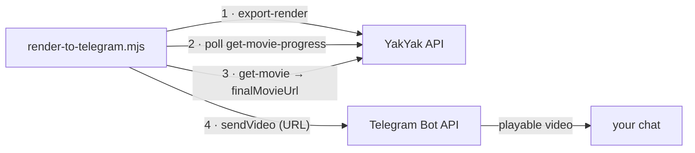
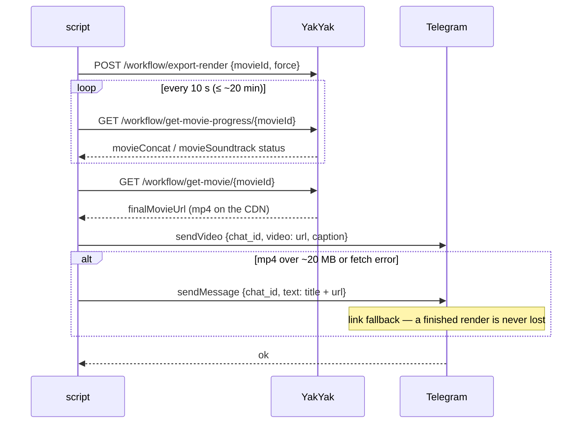

# integrations/telegram

Render a YakYak movie and deliver the finished video into a **Telegram** chat — as a
playable video, not just a link. One zero-dependency script, Node 18+ only:
[`render-to-telegram.mjs`](./render-to-telegram.mjs).

> **Why Telegram** (and not WhatsApp/Signal): the Telegram Bot API is free, needs no
> approval, and delivers a video by URL in one HTTPS call. WhatsApp requires a Meta
> Business Cloud API app (business verification, template approval); Signal requires
> running `signal-cli` with a registered phone number.

## The flow



Step by step, what a run looks like:



## Setup: the bot (~2 minutes)

1. Message [@BotFather](https://t.me/BotFather) → `/newbot` → copy the **bot token**.
2. Open a chat with your new bot and send it any message (it can't message you first), then:

   ```bash
   curl -s "https://api.telegram.org/bot<TOKEN>/getUpdates" | python3 -m json.tool
   # → result[0].message.chat.id
   ```

That token + chat id are the only Telegram credentials the script needs.

## Run it

```bash
YAKYAK_TOKEN=yy_live_… MOVIE_ID=… \
TELEGRAM_BOT_TOKEN=… TELEGRAM_CHAT_ID=… \
node integrations/telegram/render-to-telegram.mjs
```

| Env var | Required | Value |
| --- | --- | --- |
| `YAKYAK_TOKEN` | ✅ | `yy_live_…` PAT that owns the movie. |
| `MOVIE_ID` | ✅ | The `movieId` query param on the IG grid: `https://yakyak.ai/ig/<userId>?movieId=<id>`. |
| `TELEGRAM_BOT_TOKEN` | ✅ | From @BotFather. |
| `TELEGRAM_CHAT_ID` | ✅ | From `getUpdates` above. |
| `FORCE` | — | Default `true` (fresh concat). `false` lets YakYak skip the re-render when nothing changed. |
| `YAKYAK_API_BASE` | — | Default `https://api.yakyak.ai`. |

Runs anywhere Node 18+ runs — a terminal, cron, or any CI step.

## Notes

- **Cost:** each run re-renders the final concat + soundtrack (per-scene assets are
  reused). `FORCE=false` skips the re-render when YakYak thinks nothing changed.
- **Delivery:** Telegram fetches the mp4 by URL (≤ ~20 MB). Larger renders fall back to
  a message with the CDN link — the run never loses a finished render.
- To render **someone else's** grid movie, fork it first (`POST /workflow/fork-campaign`
  with `sourceCampaignId` + `sourceMovieId` — the IG-grid fork, see
  [`docs/forking.md`](../../docs/forking.md)) and pass the *forked* movie id.
